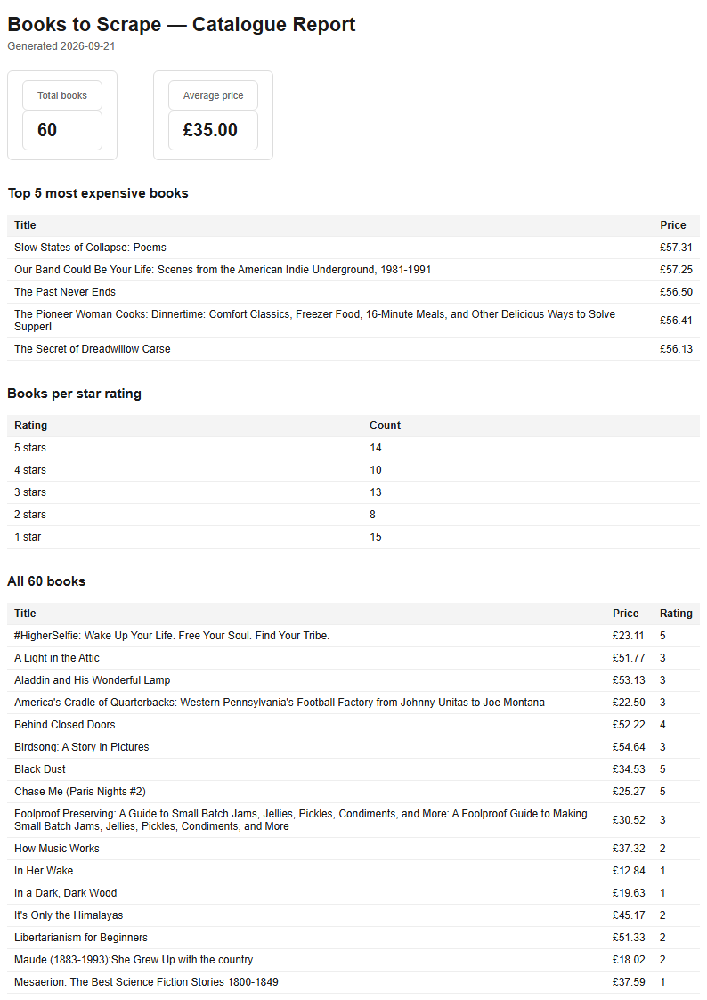

# PDF report generator

Query some data with SQL, render it into a real PDF, and let the API generate and hand it out by
link. Query → render → store → serve — the pipeline behind every "download report" button.

Built for FlyRank Internship · Backend Track · W4 · Assignment A8.

## Dataset: the bookstore

This assignment lets you seed a fake shop or reuse real data from
[A9 — The polite scraper](../scraper/). I reused A9: the 60 validated books scraped from
[books.toscrape.com](https://books.toscrape.com/), read straight from
`../scraper/output/books.json`. A real dataset produced by a real pipeline, reported on by
another one.

## Install & run

Requires [Node.js](https://nodejs.org/) 22+ (for the built-in `node:sqlite` module — no database
to install) and the A9 scraper's `output/books.json` to already exist (run A9's `npm start` once
if it doesn't).

```
cd pdf-report-generator
npm install
npx playwright install chromium   # downloads headless Chromium, ~1 min, one-time
npm run seed                      # fills report.db from ../scraper/output/books.json
npm start                         # http://localhost:3000
```

`npm run seed` deletes and re-inserts every row, so running it more than once always leaves
exactly one clean copy of the 60 books — never 120.

## The aggregation query

`src/report-data.js`'s `getReportData()`:

```sql
SELECT COUNT(*) AS totalBooks FROM books;
SELECT AVG(price) AS averagePrice FROM books;
SELECT title, price, url FROM books ORDER BY price DESC LIMIT 5;
SELECT rating, COUNT(*) AS count FROM books GROUP BY rating ORDER BY rating DESC;
```

Four totals from 60 rows: how many books, the average price, the top 5 most expensive, and how
many books sit at each star rating.

## Proof — POST, wait, download

```
$ time curl -i -X POST http://localhost:3000/reports
HTTP/1.1 201 Created
{"id":1,"file":"/reports/1/file"}
real  0m0.839s

$ curl -s -o my-report.pdf http://localhost:3000/reports/1/file
$ file my-report.pdf
my-report.pdf: PDF document, version 1.4, 3 page(s)
```

Page 1 of a generated report:



## Endpoints

| Method | Path | Description | Success | Errors |
|---|---|---|---|---|
| GET | `/health` | Health check | 200 | — |
| POST | `/reports` | Generate (or reuse today's) report | 201 new · 200 reused | — |
| GET | `/reports/:id` | The report's record + file link | 200 | 404 unknown id |
| GET | `/reports/:id/file` | Download the PDF | 200 (file) | 404 unknown id |

`POST /reports` accepts an optional body `{"force": true}` to skip the once-a-day reuse and
always generate a fresh report.

## Stage 4 — when this should leave the request

At 60 rows this takes under a second, so answering inline is fine. The moment either the dataset
or the traffic grows — a report over a few thousand rows, or more than a handful of people
clicking "generate" around the same time — is when I'd move this into a background job (A7):
the endpoint would return `202` + an id instantly, and a queued function would run
query → render → save, with `GET /reports/:id` reporting `pending` then `done`. Nobody should
have their HTTP connection held open for as long as a report takes to build.

## Stage 5 — idempotency

`POST /reports` checks whether a report already exists for today before generating a new one; if
it does, it returns that report's `id` and link with `200` instead of doing the work again. This
protects against the same thing a double-click, a retried request, or an impatient user hitting
the button twice all cause: the same intent expressed more than once. A real-world example where
skipping this check costs money: a "send invoice" button that isn't idempotent can email the same
customer the same invoice twice — annoying at best, a support ticket and a refund request at
worst.

Proof: two rapid `POST /reports` calls with no body both returned `{"id":1,...}` — the same id,
`HTTP 200` on the second call — and exactly one new file appeared in `reports/`. A follow-up call
with `{"force": true}` returned a new `id` (`2`) and a second file.

## What's on disk vs. what's in the response

Every JSON response here is a few dozen bytes — an id, a status, a link. The PDF itself, tens of
kilobytes, only ever moves once: when a client calls `GET /reports/:id/file` and the server
streams it from disk with `res.sendFile()`. That split — store the artifact, hand out its
address — is why `POST /reports` and `GET /reports/:id` stay fast even though the file behind
them is not: nobody paid the cost of moving the file's bytes except the one request that actually
wanted them.
